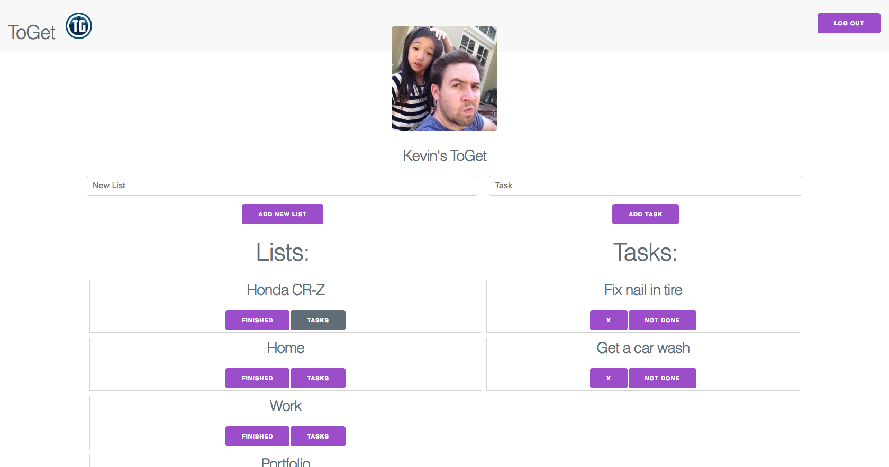

# ToGet

##### ToGet is the last todo list you'll ever need. It gives you the ability to create a list of tasks for every aspect of your life. No more switching note pads to find a todo list, you'll have them all right in front of you. You also want other people in your life to be see how busy you are? Well you can just add them to a list of tasks and get some haalp(Feature coming soon).  

---

## Technologies Used:

* HTML5 / CSS3
* JavaScript
* ES6
* **M**ongoDB
* **E**xpress
* **R**eact
* **N**ode.js

---

## Installation instructions:

##### In your terminal go into your ToGet project folder and run `npm install`  

---

## User story:

##### User has many of things to get done. User wants to separate each tasks into related folder i.e chores so that the user's todo list is organized and easy to read. User wants to be able to click on a folder and display every task inside a particular folder. User want to a be able to mark each task as done or delete the task once it is finished so that the user can check progress. User want to be able to connect with other users to have them see what needs to be completed. User wants to add a user to a particular task that needs to be completed so that the user can get help from other users to complete tasks.

---

## Future Features:

* Add another user to a list of tasks
* Messaging
* Mobile app
* Assign a users to a task
* Be able to add instruction to a task and display instructions when task is clicked on.

---

## Unsolved problems and hurdles:

* The form to create task show when a list is not selected.
* Styling. My app needs a make over.

---

## Wire frame:

---

